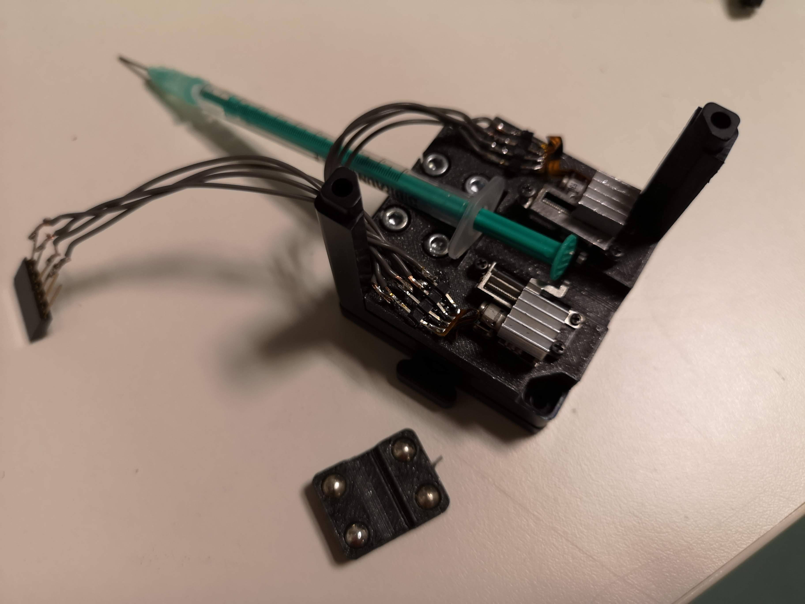

<p align="left">
<a href="#logo" name="logo"></a>
</p>

# openUC2 *Micro Syringe Pump*
---

This repository will help you to build and setup a syringe pump with *µl* precision for about 5€ in material costs. 
It makes use of tiny stepper motors usually used to have small selfie cameras popping up from your cellphone for example. A detailed introduction into these stepper can for example be found at [Hacksters](https://www.hackster.io/news/these-two-small-steppers-are-one-giant-leap-for-maker-kind-7a6b3599cfae). People also created tiny [laser engraving systems](https://www.hackster.io/news/the-open-source-burninator-explores-what-two-linear-stepper-motors-and-laser-diode-can-do-5495318dcfb8) using this motor. 

It's available at [Aliexpress](https://de.aliexpress.com/item/1005001421552415.html), where prices range from 1.20-4€. 

Curious to see what this looks like? Keep scrolling!

<p align="center">
<a href="#logo" name="logo"></a>
</p>

The overall price is in the range of ~5-10€ (depending on your resellers).


***Features:***
* Microleter dispensing using low-cost syringes
* 0.2 ml total volume
* fits in a UC2 cube


# Table of Content
* **[Software](#-software)**
* **[Hardware](#-hardware)**
* **[Bill of materials](#-bill-of-materials)**
* **[Electronics](#-electronics)**
* **[Results](#-results)**


## In-Action

This is the single-sided version, but in order to not burn the linear steppers, we encourage to use two steppers to push the piston of the syringe. 
You should see the linear level arm moving up and down.

<p align="center">
<a href="#logo" name="logo"></a>
</p>

We use this to control the flow in a FEP tube for light-sheet imaging. Here you see a zebra-fish moving back and forth passing the light-sheet:

<p align="center">
<a href="#logo" name="logo"></a>
</p>


# Software

We leave the software and electronics part to the interested user. The stepper motors behave as typical bipolar (e.g. NEMA) motors and can easily be connected to off-the shelf stepper drivers (e.g. A4988). For a detailed explanation please have a look e.g. [here](https://www.makerguides.com/drv8825-stepper-motor-driver-arduino-tutorial/). 

The wiring with te tyical motor drivers is done as follows:

```
Motor driver:

1--2--3--4
|. |. |. |
|. |. |. |
A+ A- B- B+
```

<p align="center">
<a href="#logo" name="logo"></a>
</p>


# Hardware

Below we describe how the device can be build and assembled in order to replicate the whole system as shown in the rendering above. One needs additional parts that can be found in the core [openUC2 repository](https://github.com/bionanoimaging/UC2-GIT).

## Bill of material

Below you will find all components necessary to build this device

### 3D printing files

All these files need to be printed. We used a Prusa i3 MK3 using PLA Prusament (Galaxy Black) at layer height 0.3 mm and infill 100%.
Please have a look at the [STL](./STL)-folder.


### Additional parts
This is used in the current version of the setup

|  Type | Details  |  Price | Link  |
|---|---|---|---|
| 2x Micro Linear Stepper  | moves the syringe | 1.50 € | [Aliexpress](https://de.aliexpress.com/item/1005001421552415.html)  |
| 1x 1ml Syringe  | - | 1.50 € | [Doccheck](https://www.doccheckshop.de/injektion-infusion/spritzen/feindosierungsspritzen/12275/bbraun-injekt-f-feindosierungsspritze?sPartner=google&number=110586&utm_campaign=versandkw&gclid=Cj0KCQiAuP-OBhDqARIsAD4XHpfTwykGH3wSOk8dRQvcmvvBdFwlpSBOijcBlMDO_y_j9ptW-hdIgPYaAuuoEALw_wcB)  |


* some M2 screws
* some wires
*

### Design files

The original design files are in the [INVENTOR](./INVENTOR) folder. 

### Electronics

We used the arduino CNC shield v3 to drive the stepper. Make sure you start with a very low motor curent to not burn the small steppers!


## Get Involved

This project is open so that anyone can get involved. You don't even have to learn CAD designing or programming. Find ways you can contribute in  [CONTRIBUTING](https://github.com/openUC2/UC2-GIT/blob/master/CONTRIBUTING.md)


## License and Collaboration

This project is open-source and is released under the CERN open hardware license. Our aim is to make the kits commercially available.
We encourage everyone who is using our Toolbox to share their results and ideas, so that the Toolbox keeps improving. It should serve as a easy-to-use and easy-to-access general purpose building block solution for the area of STEAM education. All the design files are generally for free, but we would like to hear from you how is it going.

You're free to fork the project and enhance it. If you have any suggestions to improve it or add any additional functions make a pull-request or file an issue.

Please find the type of licenses [here](https://github.com/openUC2/UC2-GIT/blob/master/License.md)

REMARK: All files have been designed using Autodesk Inventor 2019 (EDUCATION)


## Collaborating
If you find this project useful, please like this repository, follow us on Twitter and cite the webpage! :-)
